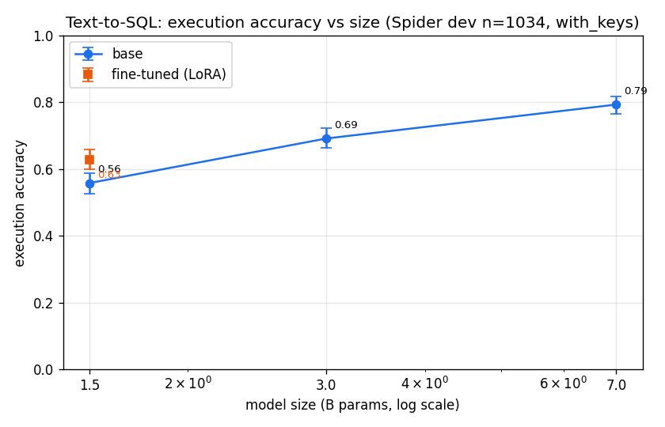

# Text-to-SQL Fine-Tune

Fine-tuning small open **Qwen2.5-Coder** models for natural-language → SQL, evaluated
with the **official Spider / test-suite evaluator**, to answer: **what actually moves
accuracy on small text-to-SQL models — model size, fine-tuning, or how you represent the
schema?**

Three ablation axes: schema representation, fine-tuning (base/few-shot/LoRA), and model
size (1.5B/3B/7B). The size ladder is one axis, not the whole thesis.

Project #2 of an LLM/NLP arc. Project #1 — the
[Biomedical RAG Agent](https://github.com/Lawson-Darrow/Biomedical-RAG-Agent) — was about
grounding and retrieval; this one is about fine-tuning and the accuracy/size frontier. The
through-line is rigorous, objective evaluation.

## Approach

```
Spider (NL + schema → SQL) → LoRA/QLoRA SFT (unsloth) on 1.5B/3B/7B
    → generate SQL → execute against the DB → execution accuracy
    → base vs fine-tuned vs frontier (via LLMGateway) → accuracy-vs-size curve
```

## Results

Full writeup: **[REPORT.md](REPORT.md)**. Narrative version: [blog post](docs/blog-text-to-sql.md).

**Size + fine-tuning** (full Spider dev, n=1034, execution accuracy, 95% bootstrap CI):



| config | execution acc | 95% CI |
|---|---|---|
| 1.5B base | 0.558 | [0.527, 0.587] |
| 3B base | 0.691 | [0.664, 0.721] |
| 7B base | 0.793 | [0.766, 0.817] |
| **1.5B fine-tuned** | **0.629** | [0.599, 0.659] |

**Findings:**
1. **Size dominates** — 0.56 → 0.69 → 0.79, all CIs non-overlapping.
2. **A one-epoch LoRA on the 1.5B is a significant +7 pts** (0.56→0.63), closing ~half the
   gap to a 2×-larger 3B base — the efficiency story.
3. **Schema representation** ([ablation chart](results/schema_ablation_combined.png), n=100):
   adding column *types* hurt execution; PK/FK keys helped exact-match; `minimal` already
   hits ~0.91 on the 7B.
4. **Rigor caught a wrong conclusion:** at n=100 the fine-tuning effect looked flat; on full
   dev with CIs it's clearly positive. Small slices lie — hence the CIs.

## Run it

```bash
bash scripts/prepare_data.sh                                    # Spider DBs + tables + evaluator (WSL2)
PYTHONPATH=src python scripts/run_ablation.py --n 100 --model Qwen/Qwen2.5-Coder-7B-Instruct
PYTHONPATH=src python scripts/run_finetune.py --model Qwen/Qwen2.5-Coder-1.5B-Instruct
PYTHONPATH=src python scripts/run_ladder.py && PYTHONPATH=src python scripts/plot_ladder.py
```

Trains locally on an RTX 4090 (24GB, Ada) under WSL2 Ubuntu (Python 3.12, env via `uv`).
See [SPEC.md](SPEC.md) for milestones and `docs/stack_derisk.md` for the verified stack.

## License

MIT — see [LICENSE](LICENSE).
