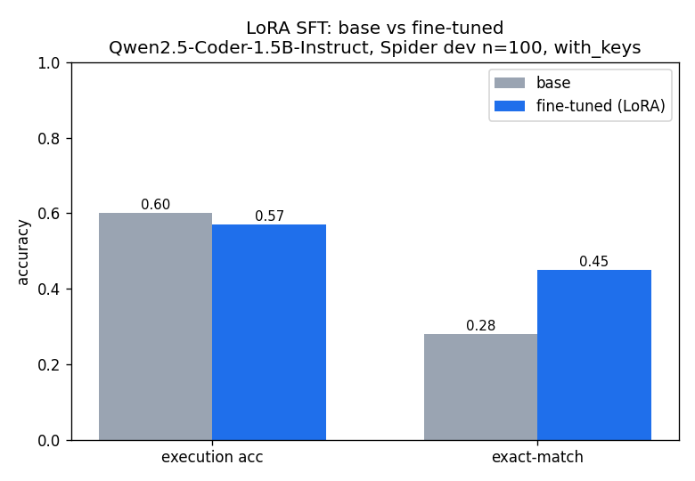
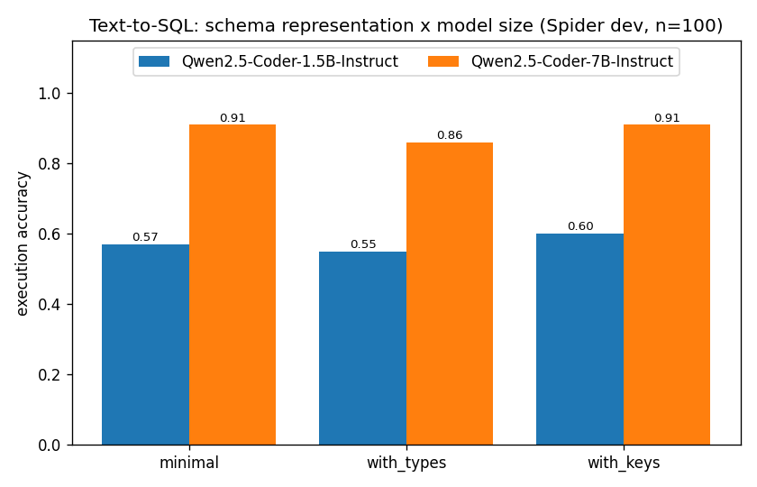

# Text-to-SQL Fine-Tune

Fine-tuning small open **Qwen2.5-Coder** models for natural-language → SQL, evaluated
with the **official Spider / test-suite evaluator**, to answer: **what actually moves
accuracy on small text-to-SQL models — model size, fine-tuning, or how you represent the
schema?**

Three ablation axes: schema representation, fine-tuning (base/few-shot/LoRA), and model
size (1.5B/3B/7B). The size ladder is one axis, not the whole thesis.

Project #2 of an LLM/NLP arc. Project #1 — the
[Biomedical RAG Agent](https://github.com/Lawson-Darrow/Biomedical-RAG-Agent) — was about
grounding and retrieval; this one is about fine-tuning and the accuracy/size frontier. The
through-line is rigorous, objective evaluation.

## Approach

```
Spider (NL + schema → SQL) → LoRA/QLoRA SFT (unsloth) on 1.5B/3B/7B
    → generate SQL → execute against the DB → execution accuracy
    → base vs fine-tuned vs frontier (via LLMGateway) → accuracy-vs-size curve
```

## Status

Milestone 5 — LoRA fine-tune (1.5B, 1 epoch on Spider train). Base vs fine-tuned, dev n=100:



| metric | base | fine-tuned | Δ |
|---|---|---|---|
| exact-match | 0.28 | 0.45 | +0.17 |
| execution | 0.60 | 0.57 | −0.03 (within n=100 noise) |

Finding: SFT taught the model Spider's gold SQL *style* (exact-match +17 pts) but execution
accuracy was flat — **exact-match and execution measure different things; matching gold style
≠ better functional correctness.** A definitive execution comparison (full dev + bootstrap CIs)
comes with the size ladder (M6).

### Milestone 4 — schema-representation ablation



Spider dev (n=100), official `test-suite-sql-eval`, execution accuracy:

| schema style | 1.5B | 7B |
|---|---|---|
| minimal | 0.57 | 0.91 |
| with_types | 0.55 | 0.86 |
| with_keys | 0.60 | 0.91 |

Findings: **(1) model size dominates** (7B ≈0.91 vs 1.5B ≈0.58). **(2) Adding column types
consistently *hurt* execution** at both sizes. **(3) PK/FK keys** gave the best exact-match
(7B 0.68) and tied best execution. `minimal` already reaches ~0.91 on 7B. Stack derisk (M2)
passed on the RTX 4090 / WSL2; evaluator wired in M3. See [SPEC.md](SPEC.md) for milestones.

```bash
# in WSL2: data + evaluator setup, then baseline / ablation
bash scripts/prepare_data.sh
PYTHONPATH=src python scripts/run_ablation.py --n 100 --model Qwen/Qwen2.5-Coder-7B-Instruct
PYTHONPATH=src python scripts/plot_ablation.py
```

## Setup (planned)

Training runs locally on an RTX 4090 (24GB, Ada) under WSL2 Ubuntu (Python 3.11–3.12). Eval
uses the official Spider / test-suite evaluator. See SPEC for the full stack.

## License

MIT (added when the repo goes public).
